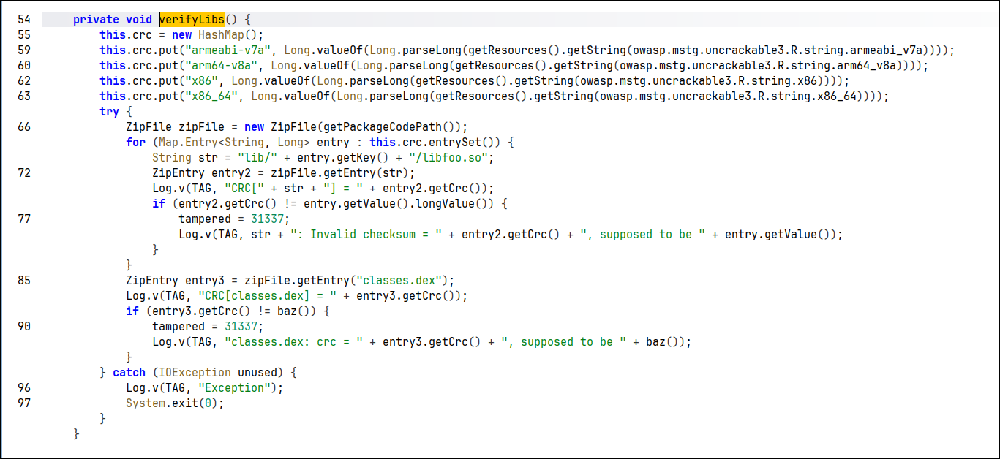
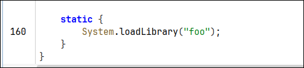
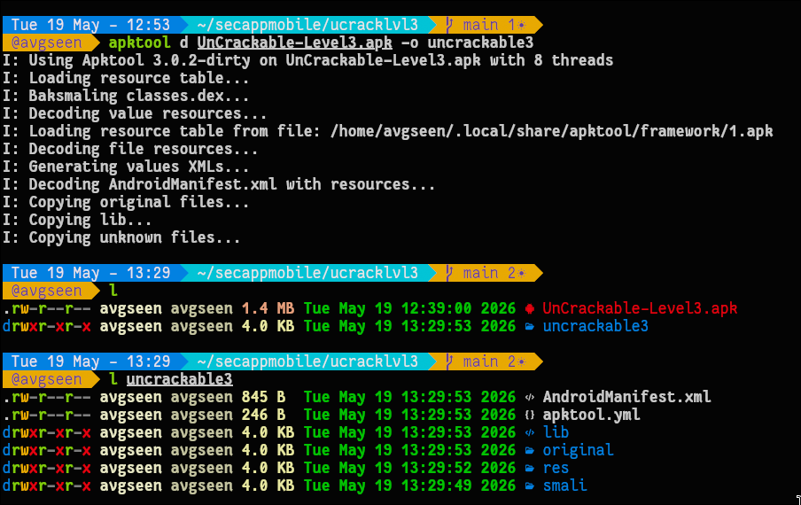
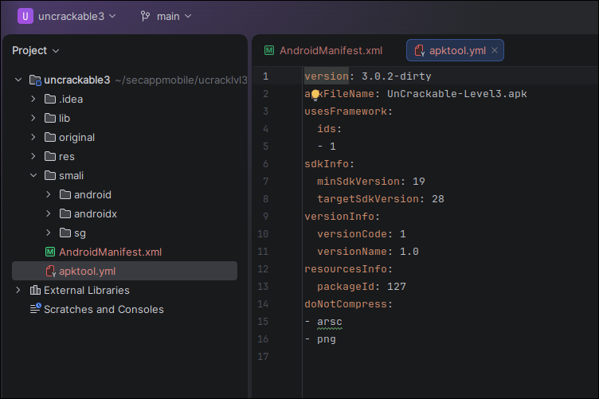
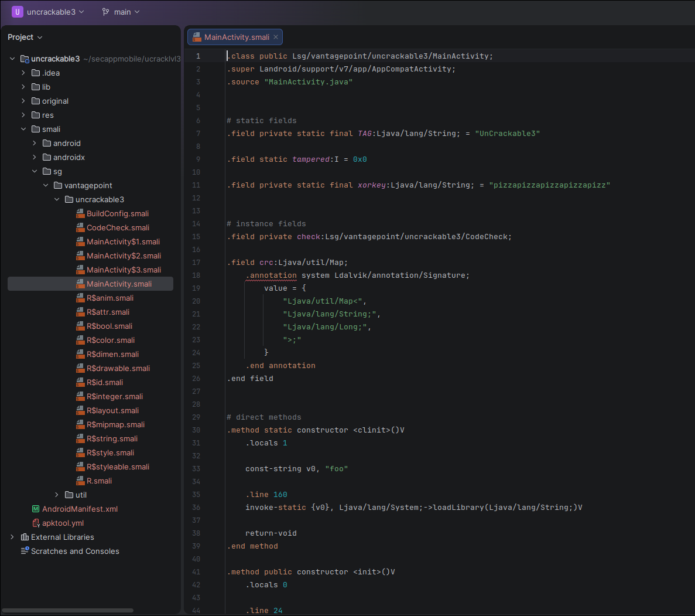
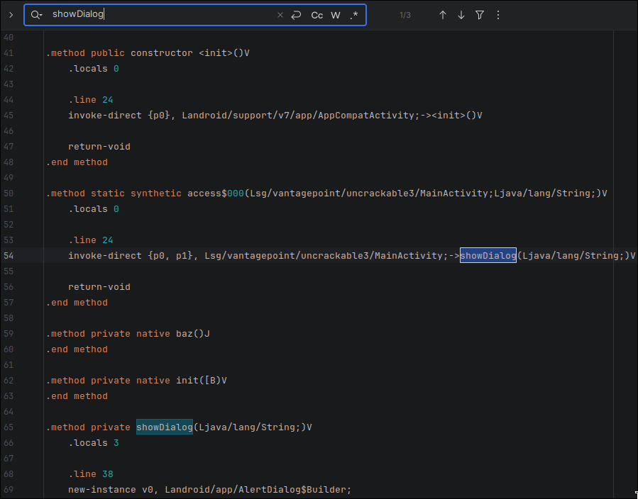
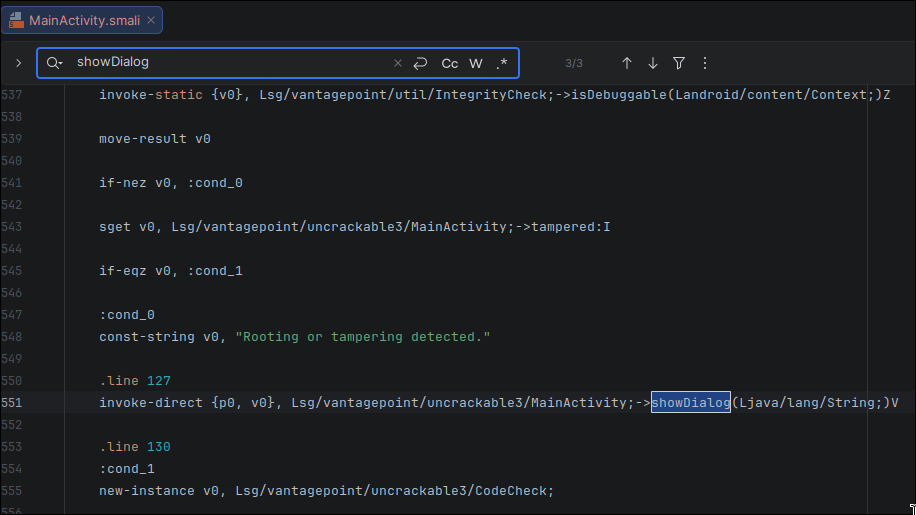
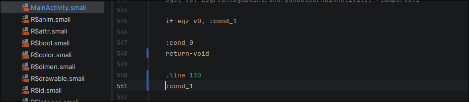
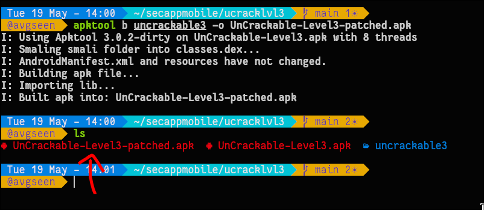
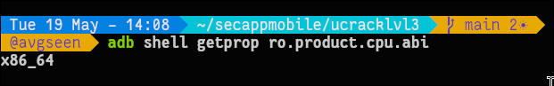

# Patch-Me Image Walkthrough

This README includes every screenshot in `images/` with a short explanation of what it captures.

## swappy-20260519-132800.png — VerifyLibs checksum checks

Shows the `VerifyLibs()` method where CRC checks are computed for the native `libfoo.so` across ABIs and for `classes.dex`, with the tamper flag set if checksums do not match.

## swappy-20260519-132850.png — Native library load

Shows the static initializer calling `System.loadLibrary("foo")` to load the native library.

## swappy-20260519-133028.png — APK unpacking with apktool

Terminal output from running `apktool d UnCrackable-Level3.apk -o uncrackable3`, followed by a directory listing of the decoded APK contents.

## swappy-20260519-133740.png — Project view of decoded APK

IDE project view highlighting `AndroidManifest.xml`, `apktool.yml`, and the decoded `smali`/`res` structure.

## swappy-20260519-133916.png — MainActivity smali fields

Shows `MainActivity.smali` with static fields such as `tampered` and the `xorkey`, plus the static constructor that loads `foo`.

## swappy-20260519-134029.png — showDialog and native methods

Highlights the `showDialog` method and the native method declarations (`baz`, `init`) inside `MainActivity.smali`.

## swappy-20260519-134045.png — Tamper/root detection dialog

Shows the `IntegrityCheck.isDebuggable` flow and the branch that calls `showDialog` with the message “Rooting or tampering detected.”

## swappy-20260519-135030.png — Conditional branch around tamper check

Displays the conditional branch near line 138 in `MainActivity.smali`, where control flow returns after the tamper check.

## swappy-20260519-140129.png — Rebuilding the APK

Terminal output from `apktool b uncrackable3 -o UnCrackable-Level3-patched.apk`, confirming the patched APK build.

## swappy-20260519-140915.png — Device ABI check

Shows `adb shell getprop ro.product.cpu.abi` reporting `x86_64` for the device architecture.
